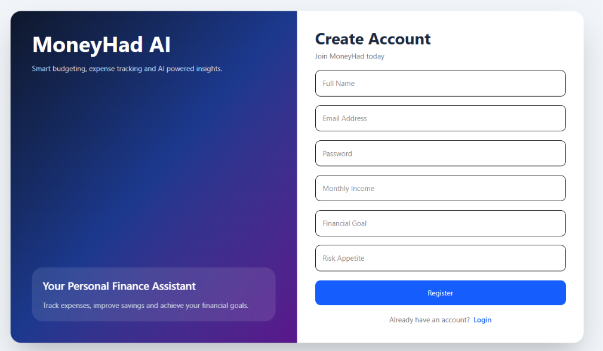
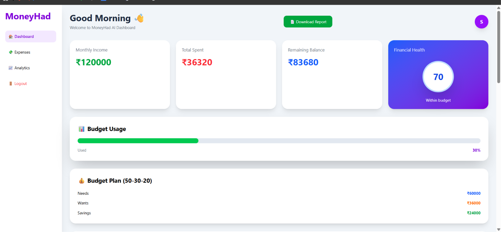
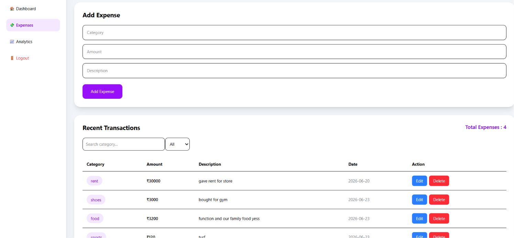
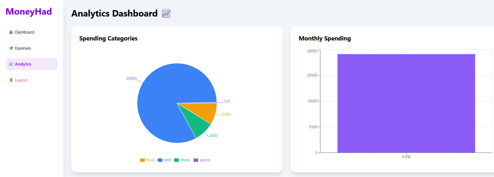
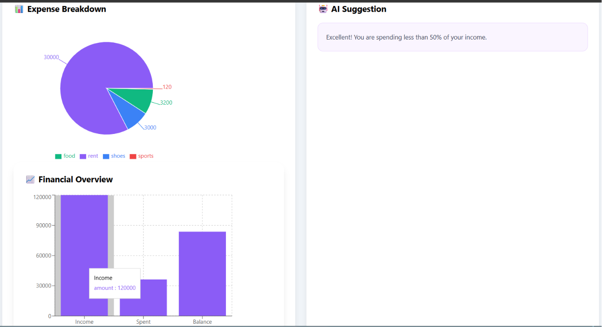
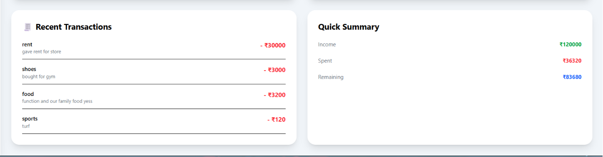
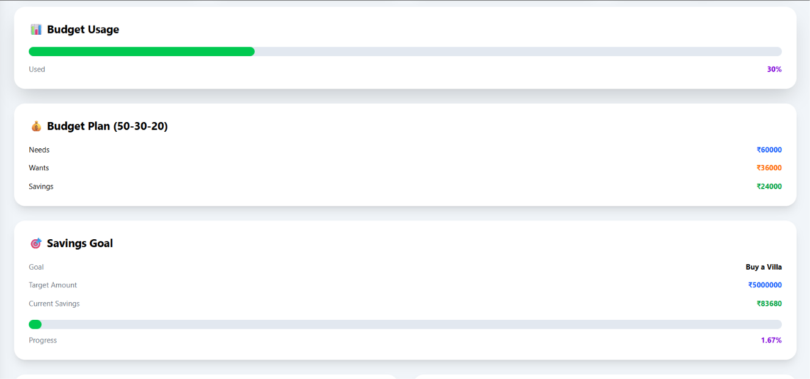

# 💰 MoneyHad AI

An AI-powered Personal Finance Management System built using **Spring Boot**, **React**, **PostgreSQL**, and **JWT Authentication**. MoneyHad AI helps users manage their expenses, analyze spending habits, plan budgets, set savings goals, and generate financial reports.

---

## 🚀 Features

- 🔐 Secure User Authentication (JWT)
- 📧 Email OTP Verification
- 💸 Expense Management (Add, Edit, Delete)
- 📊 Dashboard with Financial Overview
- 📈 Expense Analytics (Pie Chart & Bar Chart)
- 🎯 Savings Goal Tracker
- 💰 50-30-20 Budget Planner
- 🤖 AI Financial Suggestions
- 📄 PDF Report Generation
- 👤 User Profile
- 🔍 Expense Search & Category Filter
- 📱 Responsive Modern UI

---

## 🛠️ Tech Stack

### Backend
- Java 21
- Spring Boot
- Spring Security
- Spring Data JPA
- JWT Authentication
- PostgreSQL
- Maven

### Frontend
- React.js
- Vite
- Tailwind CSS
- Axios
- React Router
- React Toastify
- Chart.js

### Database
- PostgreSQL

---

# 📸 Screenshots

## Login Page


---

## Register Page



---

## Dashboard



---

## Expense Tracker



---

## Analytics



---

## Charts



---

## Profile


---

## Expense Data



---

## Goal & Budget Tracker



---

# 📂 Project Structure

```
MoneyHad-AI
│
├── backend
│   └── moneyhad
│
├── frontend
│   └── moneyhad-frontend
│
└── screenshots
```

---

# ⚙️ Installation

## Backend

```bash
cd backend/moneyhad
```

Configure PostgreSQL in:

```
application.properties
```

Run

```bash
mvn spring-boot:run
```

Backend runs on

```
http://localhost:8081
```

---

## Frontend

```bash
cd frontend/moneyhad-frontend
npm install
npm run dev
```

Frontend runs on

```
http://localhost:5173
```

---

# 🔮 Future Enhancements

- 🌙 Dark Mode
- 📱 Mobile App
- 💳 Bank Account Integration
- 📤 Email Monthly Reports
- 🤖 Advanced AI Financial Assistant
- 🔔 Smart Notifications
- 📅 Monthly Spending Forecast
- ☁️ Cloud Deployment

---

# 👨‍💻 Author

**Syed Sanhad**

- GitHub: https://github.com/SANHAD7
- LinkedIn: https://www.linkedin.com/in/syed-sanhad

---

⭐ If you like this project, don't forget to star the repository!
